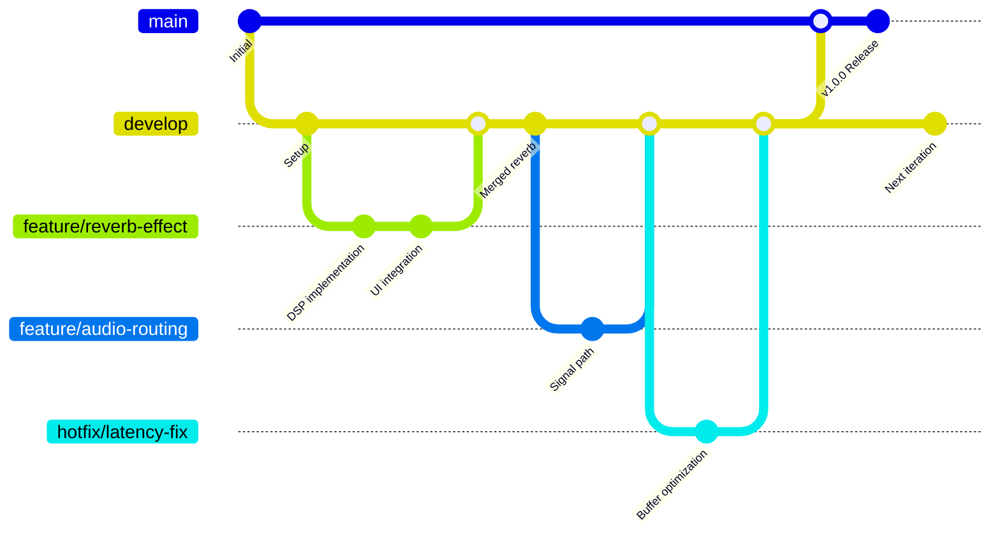

# Contributing Guide

_Audio Software Engineering Project Workflow_

## Branching Strategy



## Workflow Rules

### Branches

- **`main`**: Production-ready, stable release (mastered & ready to ship 🎚️)
- **`develop`**: Integration branch for ongoing development (mixing stage 🎛️)
- **`feature/*`**: New features/modules (branch from `develop`, merge back to `develop`)
  - Examples: `feature/reverb-effect`, `feature/midi-support`, `feature/audio-visualization`
- **`hotfix/*`**: Small urgent fixes (branch from `develop`, merge back to `develop`)
  - Examples: `hotfix/latency-fix`, `hotfix/crash-on-startup`, `hotfix/memory-leak`

### Commit Messages

All commits should follow **Conventional Commits** format:

```
<type>(<scope>): <subject>

[optional body]
```

**Types** (what kind of change):

- `feat`: New feature
- `fix`: Bug fix
- `docs`: Documentation only changes
- `style`: Code style changes (formatting, whitespace, no logic change)
- `refactor`: Code restructuring without changing functionality
- `perf`: Performance improvements
- `test`: Adding or updating tests
- `chore`: Maintenance tasks, build config, dependencies
- `ci`: CI/CD changes

**Scopes** (area/module affected):

- `dsp`: Digital signal processing modules
- `ui`: User interface components
- `audio`: Audio engine/routing
- `effects`: Audio effects processing
- `midi`: MIDI support
- `routing`: Audio routing/mixing
- `io`: Audio input/output handling
- `build`: Build system/config
- `docs`: Documentation
- `test`: Tests

**Subject** (brief description):

- Use imperative mood ("add feature" not "added feature")
- First letter lowercase
- No period at the end
- Keep under 72 characters
- Be specific and clear

**Body** (optional, for complex changes):

- Explain the "what" and "why" (not the "how")
- Wrap at 72 characters
- Can include multiple paragraphs

**Footer** (optional):

- Reference issues: `Closes #123`, `Fixes #456`
- Breaking changes: `BREAKING CHANGE: description`

**Commit Examples**:

**Features**:

```
feat(dsp): add convolution reverb algorithm
feat(ui): implement real-time waveform visualization
feat(midi): add MIDI note input support
feat(effects): add delay effect with feedback control
```

**Fixes**:

```
fix(audio): resolve buffer underrun causing clicks
fix(io): fix crash when disconnecting audio device
fix(dsp): correct sample rate conversion artifacts
fix(routing): fix channel routing bug in mixer
```

**Refactoring**:

```
refactor(dsp): optimize FFT implementation
refactor(audio): simplify buffer management logic
refactor(ui): extract audio controls into component
```

**Performance**:

```
perf(audio): reduce latency by optimizing buffer size
perf(dsp): optimize filter computation using SIMD
perf(io): improve audio I/O thread efficiency
```

**Documentation**:

```
docs(api): update audio processing API documentation
docs(readme): add installation instructions
```

**Tests**:

```
test(dsp): add unit tests for reverb algorithm
test(audio): add integration tests for routing
```

**Chores**:

```
chore(build): update build dependencies
chore(deps): upgrade audio library to v2.1.0
```

**Example with Body**:

```
feat(dsp): add convolution reverb algorithm

Implements real-time convolution reverb using impulse response
files. Supports room size and damping parameters for real-time
adjustment.

- Uses FFT-based convolution for efficient processing
- Supports IR files up to 10 seconds
- Configurable wet/dry mix ratio

Closes #42
```

### Merging

**Review Requirement**: At least **one person (who is not the author)** must review and approve before merging.

**Merge Message Format**: Use **Conventional Commits** format for merge messages:

```
<type>(<scope>): <subject>
```

**Types** (what kind of change):

- `chore`: Merging branches, maintenance tasks, build config
- `feat`: New feature (use when merging feature branches)
- `fix`: Bug fix (use when merging hotfix branches)
- `docs`: Documentation updates
- `refactor`: Code restructuring without changing functionality
- `perf`: Performance improvements
- `test`: Adding or updating tests
- `style`: Code style changes (formatting, whitespace)

**Scopes** (area/module affected):

- `merge`: General branch merges
- `dsp`: Digital signal processing modules
- `ui`: User interface components
- `audio`: Audio engine/routing
- `effects`: Audio effects processing
- `midi`: MIDI support
- `routing`: Audio routing/mixing
- `io`: Audio input/output handling
- `build`: Build system/config

**Subjects** (brief description):

- Clear, imperative mood description
- Reference the branch being merged
- Keep under 72 characters when possible

**Examples**:

**Feature Merges**:

- `feat(dsp): merge feature/reverb-effect into develop`
- `feat(ui): merge feature/audio-visualization into develop`
- `feat(midi): merge feature/midi-support into develop`
- `feat(routing): merge feature/audio-routing into develop`

**Hotfix Merges**:

- `fix(audio): merge hotfix/latency-fix into develop`
- `fix(io): merge hotfix/crash-on-startup into develop`
- `fix(perf): merge hotfix/memory-leak into develop`
- `fix(dsp): merge hotfix/buffer-overflow into develop`

**Release Merges**:

- `chore(merge): merge develop into main for v1.0.0 release`
- `chore(merge): merge develop into main for v1.2.0 release`

**Other Merges**:

- `chore(merge): merge feature/docs-update into develop`
- `refactor(dsp): merge feature/algorithm-refactor into develop`
- `perf(audio): merge feature/buffer-optimization into develop`

- Feature branches → `develop` (via PR - code review required)
- Hotfix branches → `develop` (via PR - expedited review for critical issues)
- `develop` → `main` (production releases only - when ready to ship)

**Example Merge Message**:

```
chore(merge): merge feature/reverb-effect into develop

Implements convolution reverb with configurable room size and damping.
Includes UI controls for real-time parameter adjustment.

Reviewed-by: @teammate-name
Closes #42
```

### Hotfix Policy

- **Small fixes** (quick patches): Use `hotfix/*` branch
  - Critical bugs, crashes, performance issues
- **Large fixes** (significant changes): Use `feature/*` branch instead
  - Major refactoring, architectural changes, new algorithms

### Versioning

Follow **Semantic Versioning**: `MAJOR.MINOR.PATCH`

- **PATCH** (x.y.**z**): Bug fixes, hotfixes, minor improvements
  - Example: `v1.2.0` → `v1.2.1` (fixed buffer overflow)
- **MINOR** (x.**y**.0): New features, effects, modules (backward compatible)
  - Example: `v1.2.0` → `v1.3.0` (added new reverb algorithm)
- **MAJOR** (**x**.0.0): Breaking changes, API changes, major rewrites
  - Example: `v1.3.0` → `v2.0.0` (changed audio processing API)

Tag all releases on `main` branch: `v1.0.0`, `v1.1.0`, `v2.0.0`, etc.

---
