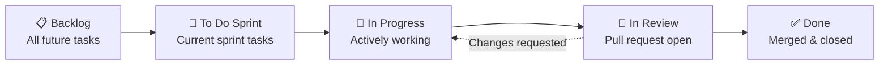

# GitHub Projects Setup

This project uses **GitHub Projects** for Agile project management. This document covers board setup, automation, labels, milestones, and workflow.

---

## Project Management Approach

**Methodology**: Agile with 1-week sprints  
**Team Size**: 5 members  
**Duration**: 12 weeks  
**Tools**: GitHub Issues, Projects (Kanban), Milestones, Pull Requests  
**Meetings**: Weekly standup on Microsoft Teams, sprint planning each Monday

---

## Kanban Board Structure



**Column Descriptions**:

1. **Backlog**: All issues not yet scheduled for a sprint
2. **To Do (Sprint)**: Issues assigned to current week's sprint
3. **In Progress**: Issues with active development (assign yourself when starting)
4. **In Review**: Pull request opened, awaiting code review
5. **Done**: PR merged, issue closed

---

## Automation Rules

GitHub Projects can automate workflow transitions:

| Trigger | Action |
|---------|--------|
| New issue labeled `bug` | → Automatically add to **Triage** column (special column for bugs) |
| Issue assigned to milestone | → Move to **Backlog** |
| PR opened and linked to issue | → Move issue to **In Review** |
| PR merged | → Move issue to **Done** and close issue |
| PR closed without merge | → Move issue back to **In Progress** |

**Setup Instructions** (for repository admin):
1. GitHub Repo → Projects → New Project → Board view
2. Settings → Workflows → Enable built-in automations
3. Custom automation via GitHub Actions (`.github/workflows/project-automation.yml`)

---

## Labels & Organization

### Priority Labels

- 🔴 **P0-blocker**: Critical issue blocking progress (immediate attention)
- 🟠 **P1-high**: Important, should be addressed soon (current sprint)
- 🟡 **P2-medium**: Normal priority (upcoming sprint)
- 🟢 **P3-low**: Nice-to-have, low urgency (backlog)

### Component Labels

- 🎛️ **dsp**: Digital signal processing, audio engine
- 🎨 **ui**: User interface, OpenGL rendering
- 🏗️ **core**: Architecture, build system, infrastructure
- 📦 **infra**: CI/CD, deployment, tooling

### Type Labels

- 🐛 **bug**: Something isn't working
- ✨ **feature**: New feature or functionality
- 🔧 **enhancement**: Improvement to existing feature
- 📚 **documentation**: Documentation updates
- 🧪 **test**: Testing-related changes

---

## Milestones

Milestones represent major project phases and align with the 12-week timeline:

| Milestone | Target Date | Description |
|-----------|-------------|-------------|
| **Alpha 0: Prototype** | Week 3 (Mar 3) | Basic plugin skeleton, simple DSP, wireframe cube |
| **Alpha 1: Audio Engine** | Week 6 (Mar 24) | Full vector synthesis engine, wavetables, filters |
| **Alpha 2: 3D UI** | Week 9 (Apr 14) | Complete 3D interface with visualizers |
| **v1.0.0 Release** | Week 12 (May 5) | Final release with installers |

**Progress Tracking**: Each milestone has a progress bar showing completed vs. total issues.

---

## Custom Fields

GitHub Projects supports custom fields for additional metadata:

| Field Name | Type | Values | Purpose |
|------------|------|--------|---------|
| **Complexity** | Number | 1, 2, 3, 5, 8 (Fibonacci) | Story points for sprint planning |
| **Component** | Select | DSP, UI, Core, Infra | Quick filtering by area |
| **Week** | Number | Week 1-12 | Track which week |
| **Owner** | Person | Team member assignment | Primary responsibility |

**Sprint Planning**: With 1-week sprints and 5 team members, target ~15-25 story points per week (adjust based on team velocity).

---

## Issue Template

To ensure consistent issue creation, use GitHub Issue Templates:

**`.github/ISSUE_TEMPLATE/feature.md`**:
```markdown
## Feature Description
[Clear description of the feature]

## Acceptance Criteria
- [ ] Criterion 1
- [ ] Criterion 2

## Technical Notes
[Implementation details, potential challenges]

## Related Issues
Closes #[issue number]
```

---

## Pull Request Workflow

1. **Branch Naming**: Follow convention from [CONTRIBUTING.md](CONTRIBUTING.md)
   - `feature/trajectory-editor`
   - `fix/crash-on-startup`
   - `hotfix/buffer-overflow`

2. **PR Requirements**:
   - Link to issue: "Closes #123"
   - Description of changes
   - Testing performed
   - Screenshots/videos for UI changes

3. **Code Review**:
   - Minimum 1 reviewer approval required
   - Automated checks must pass (CI build, tests)
   - No merge conflicts

4. **Merge Strategy**: Squash and merge (clean history)

---

## Example Workflow

**Week 4 Sprint Planning** (Phase 2 - Audio Engine):
1. Team reviews **Backlog**
2. Selects "Wavetable Oscillator" issue (#45)
3. Assigns to DSP Engineer 1
4. Moves to **To Do (Sprint)** column
5. Sets Complexity = 5, Component = DSP, Week = 4

**Development**:
1. DSP Engineer 1 assigns issue to self → Auto-moves to **In Progress**
2. Creates branch `feature/wavetable-oscillator`
3. Commits code following conventional commits
4. Opens PR → Auto-moves issue to **In Review**

**Review & Merge**:
1. Lead Architect reviews code, requests minor changes
2. DSP Engineer 1 addresses feedback
3. PR approved and merged → Issue auto-moves to **Done**
