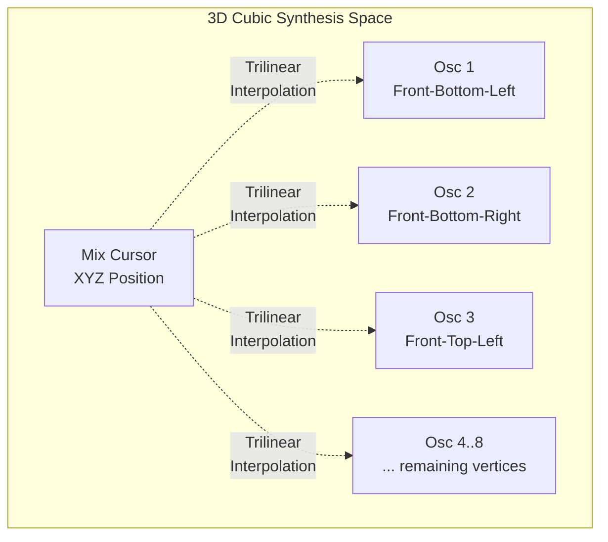
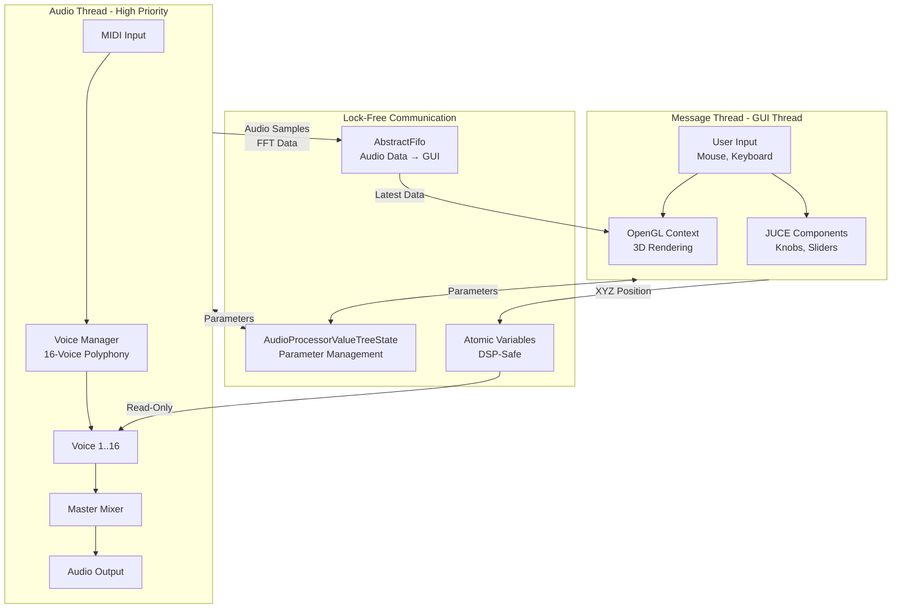
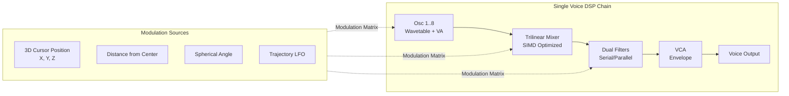
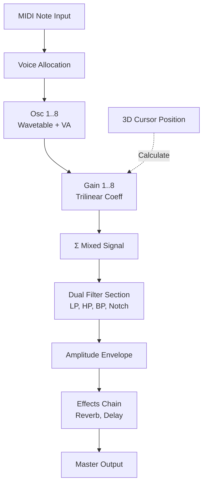
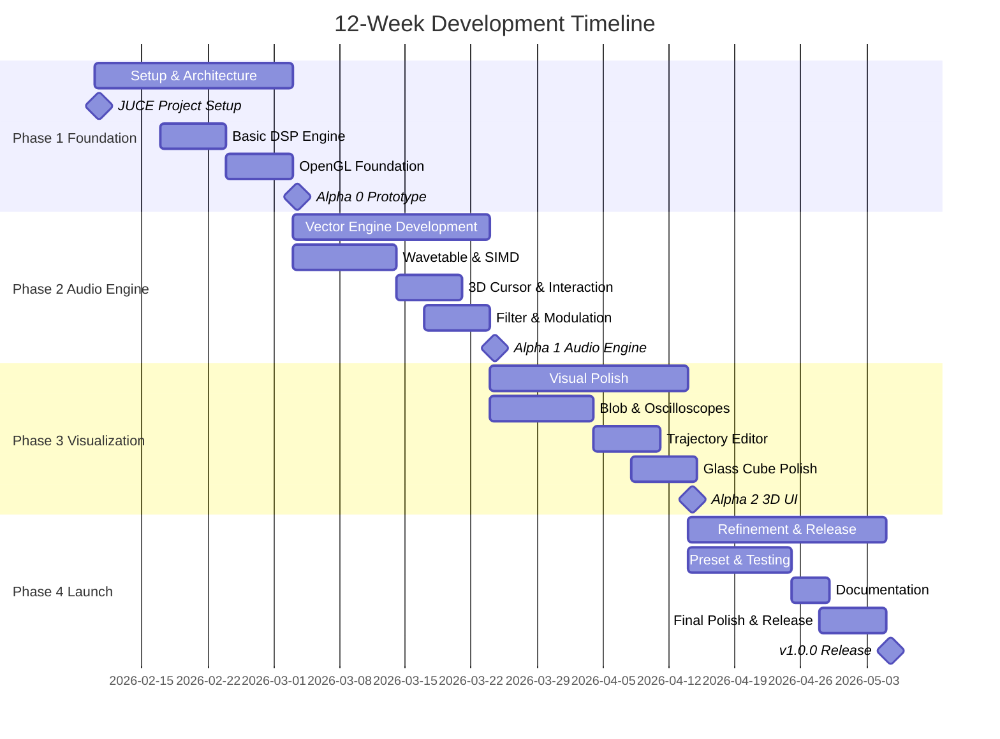

# Volumetric Vector Synthesis Plugin

<!-- [](LICENSE)
[](https://juce.com/)
[](https://www.opengl.org/)
[]() -->

## Table of Contents

- [Motivation](#motivation)
- [Applications & Target Users](#applications--target-users)
- [Core Functionality](#core-functionality)
- [Implementation Architecture](#implementation-architecture)
- [Algorithmic Foundations](#algorithmic-foundations)
- [Team Structure & Responsibilities](#team-structure--responsibilities)
- [Development Timeline](#development-timeline)
- [GitHub Projects](#github-projects)
- [Getting Started](#getting-started)
- [Contributing](#contributing)

---

## Motivation

### The Evolution Gap in Vector Synthesis

The digital audio workstation (DAW) plugin market is saturated with high-quality emulations of vintage hardware and increasingly complex wavetable synthesizers. However, a critical innovation gap exists in the realm of **true three-dimensional sound design** and spatial user interfaces.

#### Historical Context

Vector synthesis was pioneered in the mid-1980s with the **Sequential Circuits Prophet VS**, which allowed users to dynamically blend four oscillators (A, B, C, D) using a joystick in a two-dimensional space -- the famous "Diamond Patch" configuration. This technique was revolutionary, providing dynamic timbral movement that distinguished it from the static subtractive synthesis of that era.

The technology was later refined by **Korg in the Wavestation**, which introduced "Wave Sequencing" to add temporal dimension to spatial mixing. Despite these advancements and modern iterations like the Korg Wavestate and Arturia's Prophet V emulation, the fundamental interface has remained **planar -- a 2D XY pad**. This restriction limits the sonic palette to a blend of four sources.

#### The Market Gap

In 2026, the synthesizer market faces a "magic triangle" of challenges: cost, quality, and innovation. While "3D" plugins exist in the market, they primarily focus on **spatial positioning** (stereo/surround panners) rather than **timbral generation** through spatial manipulation.

For example, while [**Anukari**](https://anukari.com/) demonstrates impressive 3D physics-based synthesis, it applies the 3D interface to mass-spring systems rather than vector synthesis. There currently exists **no volumetric vector synthesizer** that allows users to "fly" through a cube of sound, blending **eight distinct timbres** in real-time.

#### Strategic Opportunity

This project addresses several emerging needs:

1. **Immersive Media Demand**: The expansion of VR/AR, spatial audio formats (Dolby Atmos), and immersive gaming requires tools for creating textures that evolve spatially and spectrally.

2. **Workflow Integration**: Currently, creating a sound that morphs between eight different states requires complex, disconnected automation lanes in a DAW. This breaks creative flow.

3. **Spatial Computing Readiness**: As user interfaces evolve toward spatial computing (Apple Vision Pro, Meta Quest), 2D knobs and sliders feel increasingly archaic. A native 3D interface positions this tool as forward-thinking and ready for next-generation input paradigms.

4. **Cognitive Alignment**: By visualizing sound sources as nodes in a 3D lattice, users can intuitively grasp the relationship between position and timbre -- moving "up" sounds brighter, moving "back" sounds darker.

---

## Applications & Target Users

### Target Users

This plugin is designed for creative professionals who demand nuanced, expressive sound design tools:

- **Sound Designers** (Film, TV, Games) - Evolving textures and atmospheres
- **Electronic Music Producers** - Novel sonic expression and automation
- **Film Composers** - Dynamic timbral evolution for cinematic scenes
- **VR/AR Audio Developers** - Spatial audio with behavioral sound objects
- **Live Performers** - Gesture-controlled expressive synthesis

### Use Cases

**Evolving Cinematic Drones**: Load industrial wavetables in bottom corners, choral/vocal wavetables in top corners. Draw a spiral trajectory ascending from floor to ceiling over 30 seconds. Map Z-axis to reverb and HPF cutoff. Result: seamless mechanical-to-organic transition with visual timing feedback.

**VR Spatial Objects**: Design proximity-reactive audio for VR elements. Map "Distance from Center" to LFO rate and wavetable position. Center position = high energy/fast modulation; edges = calm/static. Auditory feedback aligns with visual physics metaphor.

**Gestural Performance**: Map Leap Motion or MIDI controller to XYZ parameters. Place aggressive waves on front face, smooth waves on back. Hand movements physically navigate through timbral space with real-time 3D visual feedback for theremin-like expressive control.

### Differentiation from Similar Products

| Product Category                            | Focus                                | Our Differentiation                                            |
| ------------------------------------------- | ------------------------------------ | -------------------------------------------------------------- |
| **Spatial Panners** (Dolby Atmos, Waves NX) | Position existing sounds in 3D space | **Generates timbre** through 3D mixing, not just positioning   |
| **Wavetable Synths** (Serum, Vital)         | 2D wavetable navigation              | **3D spatial navigation** with 8-source volumetric blending    |
| **Physical Modeling** (Anukari)             | Mass-spring physics simulation       | **Pure timbral vector mixing** with intuitive spatial metaphor |
| **Traditional Vector Synths** (Wavestate)   | 4-source 2D XY pad                   | **8-source 3D cubic space** with depth and complexity          |

---

## Core Functionality

### User Experience Overview

At its core, this plugin provides an intuitive **three-dimensional sound design environment** where users manipulate a virtual cursor within a cubic space to blend eight distinct sound sources in real-time.


### The "Glass Cube" Interface



#### Visual Components

1. **Semi-Transparent Cubic Frame**: Provides constant spatial reference with glowing edges
2. **8 Oscillator Nodes**: Located at cube vertices, each containing:
    - Miniature oscilloscope display
    - Brightness/size indication of mix contribution
    - Real-time waveform visualization
3. **Mix Cursor**: Central control point that:
    - Casts semi-transparent shadows on back/floor walls for depth perception
    - Contains audio-reactive "Blob" visualizer
    - Responds to trilinear interpolation calculations
4. **Trajectory Ribbons**: Glowing "neon tubes" showing automated modulation paths
    - Traveling "bead" of light indicates current LFO phase
    - Smooth tricubic interpolation for organic motion

#### Interaction Methods

| Input Method           | Action                            | Result                    |
| ---------------------- | --------------------------------- | ------------------------- |
| **Left Click + Drag**  | Move cursor in current view plane | XY position adjustment    |
| **Right Click + Drag** | Rotate camera (orbital controls)  | View angle change         |
| **Scroll Wheel**       | Move along depth axis             | Z-axis adjustment         |
| **Z-Plane Slider**     | Direct Z-axis control             | Precise depth positioning |
| **Ray Casting**        | Select objects in 3D space        | Trajectory point editing  |

#### Real-Time Visual Feedback

**Blob Visualizer**:

- Signed Distance Field (SDF) rendered via raymarching in fragment shader
- Deforms in real-time based on audio amplitude and frequency spectrum
- Provides visceral feedback: rough/loud sound = spiked/large; smooth/quiet = round/small

**Oscilloscope Nodes**:

- Proximity-based brightness and scale
- Dominant oscillators glow brighter as cursor approaches
- Instanced rendering for performance optimization

---

## Implementation Architecture

### System Overview



### Voice Architecture



### Signal Flow



### Technology Stack

#### Core Framework: JUCE 8

**JUCE** (Jules' Utility Class Extensions) is the foundation of this project, providing:

- Cross-platform audio plugin wrapper (VST3, AU, AAX)
- DSP processing infrastructure
- GUI framework with hybrid rendering support
- Parameter management system (AudioProcessorValueTreeState)

**Hybrid Rendering Architecture**:

- **OpenGL 3.3+**: 3D visualization (cube, oscilloscopes, blob, trajectories)
- **Direct2D/Native**: 2D controls (knobs, sliders, buttons)
- **Single-Context Strategy**: One OpenGLContext attached to top-level editor to avoid Z-ordering conflicts

### Key Components

| Component             | Description                                              | Technology                              |
| --------------------- | -------------------------------------------------------- | --------------------------------------- |
| **Voice Manager**     | 16-voice polyphony with dynamic allocation               | JUCE Synthesiser class                  |
| **Oscillator Engine** | Virtual Analog Wavetable (Saw, Square, Triangle, Sine)   | JUCE dsp::Oscillator, custom wavetable  |
| **Trilinear Mixer**   | 8-to-1 mixing with SIMD optimization                     | Custom C++ with juce::dsp::SIMDRegister |
| **Filter Section**    | Dual filters (LP/HP/BP/Notch, 12/24 dB/oct)              | JUCE dsp::LadderFilter                  |
| **Modulation Matrix** | Route 3D parameters to synthesis params                  | Custom parameter routing                |
| **OpenGL Renderer**   | 3D cube, visualizers, trajectories                       | OpenGL 3.3+, GLSL shaders               |
| **Ray Caster**        | 3D mouse interaction                                     | GLM ray-sphere intersection             |
| **Trajectory Engine** | Automated cursor paths with spline interpolation         | Custom tricubic implementation          |

### Third-Party Libraries

#### Required

- **JUCE 8**: Audio plugin framework ([juce.com](https://juce.com/))
- **GLM 0.9.9+**: 3D mathematics library ([github.com/g-truc/glm](https://github.com/g-truc/glm))
- **OpenGL 3.3+**: Graphics API (system-provided)

<!-- #### Optional

- **ImGui**: Debug overlay UI for development profiling
- **Catch2**: Unit testing framework -->

#### Rationale for Library Choices

**Why JUCE 8?**

- Industry-standard for audio plugin development
- Cross-platform (Windows, macOS, Linux)
- Comprehensive DSP library with SIMD support
- Active development and strong community

---

## Algorithmic Foundations

Core algorithms powering the volumetric synthesis engine:

### 1. Trilinear Interpolation

**Purpose**: Blend 8 oscillators based on 3D cursor position with unity gain throughout the cubic space.

**Method**: Given position $(x, y, z) \in [0, 1]^3$, gain for each oscillator is proportional to the volume of the opposite rectangular prism. For example: oscillator at $(0,0,0)$ has gain $g_{000} = (1-x)(1-y)(1-z)$. Implemented as three-stage linear interpolation (X→Y→Z) followed by SIMD-optimized multiply-accumulate. Sum of all 8 gains guaranteed to equal 1.0.

**References**: [Wikipedia: Trilinear Interpolation](https://en.wikipedia.org/wiki/Trilinear_interpolation), ["Three-Dimensional Lookup Table With Interpolation"](https://spie.org/samples/PM159.pdf)

### 2. Tricubic Interpolation / Catmull-Rom Splines

**Purpose**: Smooth trajectory paths with C^2 continuity (continuous velocity and acceleration) to avoid audible clicks from sharp corners.

**Method**: Pre-compute Catmull-Rom splines at high resolution (e.g., 1000 samples) and store in lookup table. Runtime uses cheap table interpolation instead of expensive per-sample polynomial evaluation.

**References**: ["Tricubic interpolation of discrete surfaces for binary volumes"](https://ieeexplore.ieee.org/abstract/document/1260750), ["Tricubic Interpolation"](https://www.sciencedirect.com/science/chapter/edited-volume/pii/B9780125434577500243)

<!-- ### 3. Signed Distance Field (SDF) Rendering

**Purpose**: Audio-reactive "blob" visualizer deformed by amplitude and spectrum.

**Method**: GPU raymarching in fragment shader. Base sphere SDF modified by audio amplitude and Fractal Brownian Motion driven by frequency spectrum. Result: loud/harsh sound → large/spiked blob; soft/quiet → small/smooth sphere.

**References**: Inigo Quilez [iquilezles.org](https://iquilezles.org), "Raymarching Distance Fields" -->
<!--
### 4. Ray Casting for 3D Interaction

**Purpose**: Convert 2D mouse clicks to 3D object selection.

**Method**: Project ray from camera through screen coordinates using `glm::unProject()`, test ray-sphere intersection with `glm::intersectRaySphere()` for cursor/trajectory point picking.

**References**: "Real-Time Rendering" (Akenine-Möller, Haines), GLM documentation -->

### 3. SIMD Optimization [REACH GOAL]

**Purpose**: Vectorize trilinear mixer for 3-4x speedup.

**Method**: Use `juce::dsp::SIMDRegister` to process 4-8 samples simultaneously (platform-dependent: AVX2 on Intel/AMD, NEON on Apple Silicon) instead of scalar per-sample computation.

**References**: JUCE "Introduction to DSP", Intel/ARM Intrinsics Guides

---

## Team Structure & Responsibilities

This project requires expertise across multiple domains: audio DSP, 3D graphics, and software architecture. The team is organized using a **RACI matrix** (Responsible, Accountable, Consulted, Informed).

### Team Roles (5 Members)

| Role                           | Core Responsibilities                                                                                                                  | Key Technologies                                          |
| ------------------------------ | -------------------------------------------------------------------------------------------------------------------------------------- | --------------------------------------------------------- |
| **Lead Architect**             | Plugin skeleton (JUCE/CMake), build systems, CI/CD pipeline, thread safety architecture, preset management, version control strategy   | C++17, JUCE 8, CMake, Git/GitHub, Threading concepts      |
| **DSP Engineer 1**             | Vector mixer algorithm, oscillator design, SIMD optimization, audio performance profiling, shared QA/automation (tests, profiling, CI) | C++, DSP theory, SIMD (AVX2/NEON), juce::dsp, Testing/CI  |
| **DSP Engineer 2**             | Filter implementation, modulation matrix, wavetable engine, effects processing, shared QA/automation (tests, regression)               | C++, DSP theory, Signal processing, juce::dsp, Testing    |
| **DSP Engineer 3**             | Trajectory/spline algorithm (tricubic interpolation), voice effects, shared QA/automation                                              | C++, DSP theory, juce::dsp, Testing                       |
| **3D Graphics / UX Developer** | OpenGL renderer, GLSL shaders, 3D interaction design, visualizers (blob, oscilloscopes), trajectory editor UI, camera controls         | OpenGL 3.3+, GLSL, GLM, UX/UI design, Spatial interaction |

### Work Assignment Matrix (RACI)

| Feature / Module         | Lead Architect | DSP Eng 1 | DSP Eng 2 | DSP Eng 3 | Graphics/UX Dev |
| ------------------------ | -------------- | --------- | --------- | --------- | --------------- |
| **Plugin Skeleton**      | **A**          | C         | C         | C         | C               |
| **Vector Mixer Core**    | **A**          | C         | C         | **R**     | I               |
| **3D Cube Renderer**     | C              | I         | I         | **R**     | **A**           |
| **Visualizers**          | C              | C         | I         | C         | **A**           |
| **Thread Safety**        | **A**          | C         | **R**     | C         | C               |
| **Trajectory Logic**     | C              | **R**     | C         | **A**     | **R**           |
| **Filter Section**       | C              | C         | **A**     | **R**     | I               |
| **Modulation Matrix**    | **A**          | C         | **R**     | C         | C               |
| **Wavetable Engine**     | **A**          | **R**     | C         | C         | I               |
| **Camera & Interaction** | I              | **R**     | I         | I         | **A**           |
| **Preset Management**    | **A**          | C         | C         | **R**     | C               |
| **SIMD Optimization**    | C              | **A**     | **R**     | I         | I               |
| **Build & Release**      | **A**          | C         | C         | C         | I               |

**Legend**:

- **R** (Responsible): Does the work
- **A** (Accountable): Ultimately answerable (approves/signs off)
- **C** (Consulted): Provides input (two-way communication)
- **I** (Informed): Kept up-to-date (one-way communication)

### Collaboration Notes

- **Roles can overlap**: Team members are expected to collaborate across domain boundaries
- **Pair Programming**: Complex features (trajectory splines, thread safety) benefit from paired work between DSP and Graphics developers
- **Code Review**: Mandatory for all pull requests -- minimum one reviewer who is not the author
- **Knowledge Sharing**: Weekly standups on Microsoft Teams to discuss challenges and share domain expertise

---

## Development Timeline

This project follows a **12-week Agile development plan** divided into four major phases, each with specific milestones and deliverables.

### Timeline Overview (Gantt Chart)



### Phase 1: Foundation (Weeks 1-3)

**Milestone**: Prototype & Core Architecture  
**Timeline**: Feb 10 - Mar 3, 2026

#### Deliverables

| Week | Task                            | Owner                | Description                                                                     |
| ---- | ------------------------------- | -------------------- | ------------------------------------------------------------------------------- |
| 1    | **Project Setup + Basic Voice** | Lead Arch + DSP1     | JUCE 8 project, CMake, CI pipeline, 8-oscillator voice (sine waves), MIDI input |
| 2    | **Trilinear Mixer + OpenGL**    | DSP1 + Graphics      | Trilinear interpolation algorithm, OpenGL context, wireframe cube rendering     |
| 3    | **Thread Safety + Camera**      | Lead Arch + Graphics | AbstractFifo for audio→GUI, atomic parameters, orbital camera controls          |

**Success Criteria**: Plugin loads in DAW, plays sine tones, displays 3D wireframe cube that can be rotated.

### Phase 2: The Audio Engine (Weeks 4-6)

**Milestone**: The Vector Engine  
**Timeline**: Mar 3 - Mar 24, 2026

#### Deliverables

| Week | Task                                 | Owner       | Description                                                                             |
| ---- | ------------------------------------ | ----------- | --------------------------------------------------------------------------------------- |
| 4    | **Wavetable + SIMD**                 | DSP1 + DSP2 | Wavetable engine with .wav import, SIMD-optimized mixer using `juce::dsp::SIMDRegister` |
| 5    | **3D Cursor + Ray Casting**          | Graphics    | Mouse/scroll → 3D cursor position, ray-sphere intersection, shadow projections          |
| 6    | **Filters + Mod Matrix + Profiling** | DSP2 + DSP1 | Dual filters, modulation matrix (XYZ → params), CPU profiling                           |

**Success Criteria**: 16-voice polyphony with wavetables, interactive 3D cursor, filters modulated by position, CPU < 15%.

### Phase 3: Visualization & Experience (Weeks 7-9)

**Milestone**: Visual Polish  
**Timeline**: Mar 24 - Apr 14, 2026

#### Deliverables

| Week | Task                         | Owner                  | Description                                                                              |
| ---- | ---------------------------- | ---------------------- | ---------------------------------------------------------------------------------------- |
| 7    | **SDF Blob + Oscilloscopes** | Graphics               | Raymarching SDF shader (audio-reactive), 8 corner oscilloscopes with instanced rendering |
| 8    | **Trajectory System**        | DSP1 + DSP3 + Graphics | Catmull-Rom splines, trajectory editor UI with control points, preview animation         |
| 9    | **Glass Cube Polish**        | Graphics               | Transparency, bloom, glowing edges, depth cues, neon trajectory ribbons                  |

**Success Criteria**: Stunning 3D interface with audio-reactive elements, smooth trajectory animation, professional aesthetic.

### Phase 4: Refinement & Launch (Weeks 10-12)

**Milestone**: v1.0.0 Release  
**Timeline**: Apr 14 - May 5, 2026

#### Deliverables

| Week | Task                        | Owner                 | Description                                                                        |
| ---- | --------------------------- | --------------------- | ---------------------------------------------------------------------------------- |
| 10   | **Preset System + Testing** | Lead Arch + DSP1/DSP2 | Preset browser, XML state saving, factory presets, platform/DAW testing, bug fixes |
| 11   | **Documentation + Beta**    | All                   | User guide, quick start, tutorial video, beta testing with feedback iteration      |
| 12   | **Installer + Release**     | Lead Arch + All       | Build installers (Windows/macOS), code signing, final polish, v1.0.0 release       |

**Success Criteria**: Stable v1.0.0 release with installers, working on major DAWs, < 5 critical bugs.

---

## GitHub Projects

Project tracking uses **GitHub Projects** (Kanban, 1-week sprints). For board setup, automation rules, labels, milestones, and workflow details, see **[GITHUB_PROJECTS.md](GITHUB_PROJECTS.md)**.

---

## Getting Started

> coming soon

<!--
### Prerequisites

Before building this project, ensure you have the following installed:

| Requirement | Version | Purpose |
|-------------|---------|---------|
| **JUCE Framework** | 8.0+ | Audio plugin framework |
| **CMake** | 3.20+ | Build system generator |
| **C++ Compiler** | C++17 support | Code compilation |
| **OpenGL** | 3.3+ drivers | 3D rendering |
| **Git** | Latest | Version control |

**Platform-Specific**:

**Windows**:
- Visual Studio 2019/2022 with C++ workload
- Windows SDK 10.0.19041.0+

**macOS**:
- Xcode 13+ with Command Line Tools
- macOS 12 (Monterey) or later

### Build Instructions

**Coming Soon**: Detailed build instructions will be provided once initial implementation is complete.

Planned build process:
```bash
# Clone repository
git clone https://github.com/your-username/volumetric-vector-synth.git
cd volumetric-vector-synth

# Initialize submodules (JUCE, GLM)
git submodule update --init --recursive

# Create build directory
mkdir build && cd build

# Configure with CMake
cmake ..

# Build
cmake --build . --config Release

# Install plugin (platform-specific)
cmake --install .
```

### Basic Usage

**Coming Soon**: User guide and tutorial videos will be available with the v1.0.0 release.

**Quick Start Concepts**:
1. Load plugin in your DAW (VST3/AU/AAX)
2. Play MIDI notes to hear default preset
3. Left-click and drag in 3D cube to move cursor
4. Right-click and drag to rotate view
5. Scroll wheel to adjust depth (Z-axis)
6. Load wavetables into 8 oscillator slots
7. Draw trajectory paths for automated movement -->

---

## Contributing

We welcome contributions from the community! Please read our detailed [CONTRIBUTING.md](CONTRIBUTING.md) for guidelines on:

- **Branching Strategy**: `main`, `develop`, `feature/*`, `hotfix/*`
- **Commit Conventions**: Conventional Commits format
- **Code Review Process**: Minimum 1 reviewer approval
- **Testing Requirements**: Unit tests for new features
- **Pull Request Template**: What to include in PR descriptions

<!-- ### Quick Contribution Guide

1. Fork the repository
2. Create feature branch from `develop`: `git checkout -b feature/your-feature develop`
3. Make changes following code style guidelines
4. Write tests for new functionality
5. Commit using conventional commits: `feat(dsp): add resonance control`
6. Push to your fork and open pull request to `develop` branch
7. Respond to code review feedback -->

---

## Project Status

**Team Size**: 5 members  
**Duration**: 12 weeks  
**Current Phase**: Planning & Documentation (Week 0)  
**Next Milestone**: Alpha 0 Prototype (Week 3 - Mar 3, 2026)  
**Target Release**: v1.0.0 (May 5, 2026)

**Development Progress**: See [GitHub Projects Board](https://github.com/users/rp-bot/projects/8) for real-time status.
