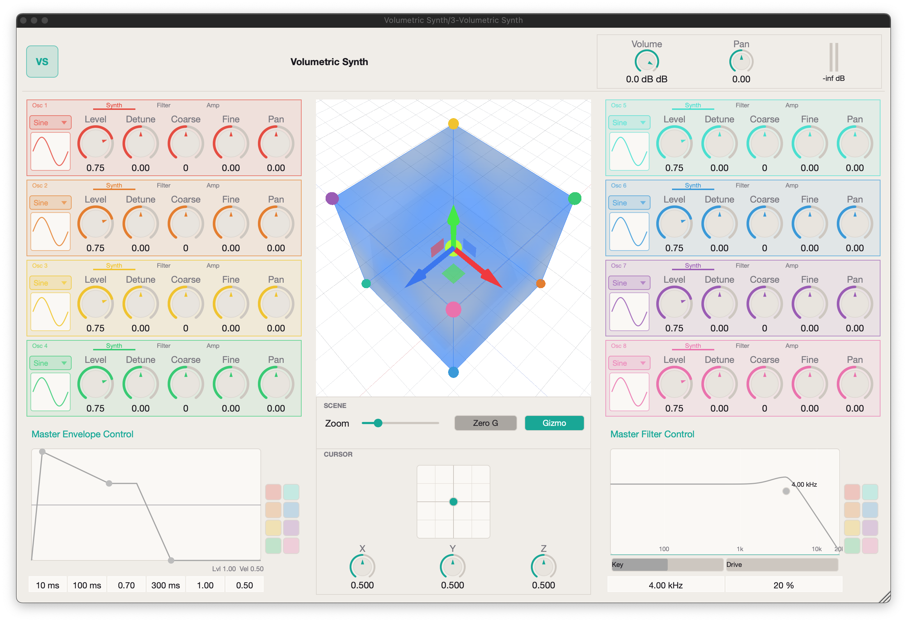

# Volumetric Vector Synthesis Plugin

<!-- [](LICENSE)
[](https://juce.com/)
[](https://www.opengl.org/)
[]() -->


## Quick Links

- [Motivation](#motivation)
- [Applications & Target Users](#applications--target-users)
- [Description](#description)
- [Getting Started](#getting-started)
- [Contributing](#contributing)
- [Credits](#credits)
- [License](#license)

## Motivation

Classic vector synthesis is still mostly limited to a 2D XY surface with 4-source blending.
This project extends that model to a true 3D space, where users can morph across 8 timbral corners in real time.

The core aim is workflow clarity: shape complex timbral motion with direct spatial gestures instead of many disconnected automation lanes.

## Applications & Target Users

Built for creators who need expressive, evolving timbre:
- **Sound designers and composers** (film, TV, games)
- **Electronic producers and live performers**
- **VR/AR audio developers**

## Description

Volumetric Vector Synthesis Plugin is a JUCE-based instrument concept for 3D timbral navigation.
Instead of static patch switching, users move through a cubic sound field and blend eight sound sources continuously.

Planned scope:
- real-time 3D interpolation between 8 oscillators
- trajectory-based movement through timbral space
- interactive 3D UI for cursor and path control


## Getting Started

### Prerequisites

- CMake 3.22+
- Git
- A C++17 toolchain
  - **macOS**: Xcode + Command Line Tools
  - **Windows**: Visual Studio 2022 (Desktop development with C++)
  - **Linux**: GCC or Clang, plus OpenGL/X11 development packages

Dependencies (`JUCE` and `glm`) are fetched automatically by CMake.

### Cross-Platform Build (Release)

```bash
git clone <your-fork-or-repo-url>
cd ASE-final-project
cmake -S . -B build -DCMAKE_BUILD_TYPE=Release
cmake --build build --config Release
```

### Platform-Specific Configure Commands

**macOS (Apple Silicon):**
```bash
cmake -S . -B build -G Xcode -DCMAKE_OSX_ARCHITECTURES=arm64
cmake --build build --config Release
```

**macOS (Intel):**
```bash
cmake -S . -B build -G Xcode -DCMAKE_OSX_ARCHITECTURES=x86_64
cmake --build build --config Release
```

**Windows (Visual Studio 2022):**
```bash
cmake -S . -B build -G "Visual Studio 17 2022" -A x64
cmake --build build --config Release
```

**Linux (Ninja):**
```bash
cmake -S . -B build -G Ninja -DCMAKE_BUILD_TYPE=Release
cmake --build build
```

### Optional Build Flags

- `-DUSE_JUCE_DEVELOP=ON` to use JUCE `develop` (helpful for newer macOS/Xcode setups).

### Build Tests

```bash
cmake --build build --target VolumetricSynth_Tests --config Release
```

### Build Outputs

- `VST3` and `Standalone` on all supported platforms
- `AU` on macOS

---

## Contributing

We welcome contributions from the community! Please read our detailed [CONTRIBUTING.md](CONTRIBUTING.md) for guidelines on:

- **Branching Strategy**: `main`, `develop`, `feature/*`, `hotfix/*`
- **Commit Conventions**: Conventional Commits format
- **Code Review Process**: Minimum 1 reviewer approval
- **Testing Requirements**: Unit tests for new features
- **Pull Request Template**: What to include in PR descriptions

## Credits

- **Angelina**: UI, parts of I/O, and plumbing between the audio engine and editor parameters
- **Canting**: DSP and UI implementation
- **Griffin**: Wavetable oscillator implementation
- **Lennon**: 3D visualization, envelope, plumbing, and bug fixes
- **Pratham**: architecture setup, UI implementation, bug fixes, and parts of 3D visualization

## License

License details are to be finalized and will be added in a future update.