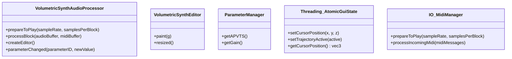
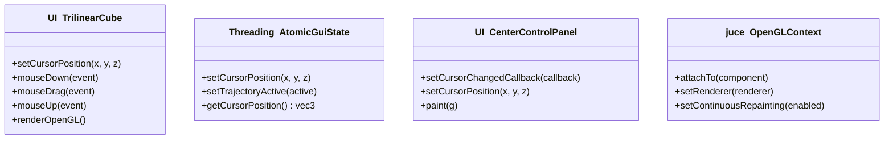
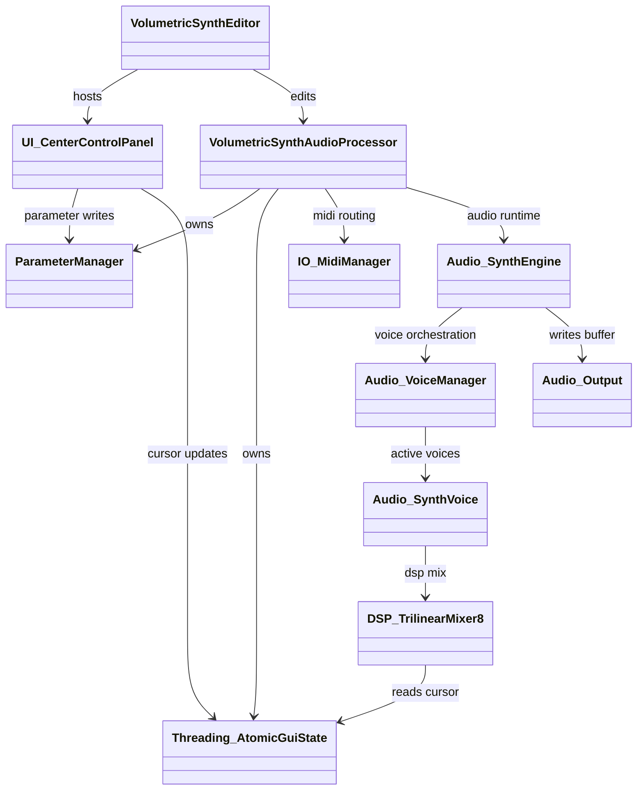

# Module Overview Class Diagrams

## Audio Engine

```mermaid
classDiagram
    class Audio_SynthEngine {
        +prepare(sampleRate, blockSize)
        +processBlock(audioBuffer, midiBuffer)
        +noteOn(channel, note, velocity)
        +noteOff(channel, note, velocity)
    }
    class Audio_VoiceManager {
        +prepare(sampleRate, blockSize)
        +noteOn(channel, note, velocity)
        +noteOff(channel, note, velocity)
        +renderNextBlock(outputBuffer, startSample, numSamples)
    }
    class Audio_SynthVoice {
        +prepare(sampleRate, blockSize)
        +startNote(note, velocity, sound, pitchWheel)
        +stopNote(velocity, allowTailOff)
        +renderNextBlock(outputBuffer, startSample, numSamples)
    }
    class DSP_Oscillator {
        <<interface>>
        +processSample() float
        +setFrequency(frequencyHz)
        +setPhase(phase)
        +reset()
    }
    class DSP_TrilinearMixer8 {
        +prepare(sampleRate)
        +processBlock(input, output, channels, samples)
        +updateGainsFromPosition(x, y, z)
    }
    class DSP_AmpEnvelope {
        +prepare(sampleRate)
        +noteOn()
        +noteOff()
        +processSample() float
    }
```

## Plugin

```mermaid
classDiagram
    class VolumetricSynthAudioProcessor {
        +prepareToPlay(sampleRate, samplesPerBlock)
        +processBlock(audioBuffer, midiBuffer)
        +createEditor()
        +parameterChanged(parameterID, newValue)
    }

    class VolumetricSynthEditor {
        +paint(g)
        +resized()
    }

    class ParameterManager {
        +getAPVTS()
        +getGain()
    }

    class Threading_AtomicGuiState {
        +setCursorPosition(x, y, z)
        +setTrajectoryActive(active)
        +getCursorPosition() vec3
    }

    class IO_MidiManager {
        +prepareToPlay(sampleRate, samplesPerBlock)
        +processIncomingMidi(midiMessages)
    }
```

## Visualization

```mermaid
classDiagram
    class UI_TrilinearCube {
        +setCursorPosition(x, y, z)
        +mouseDown(event)
        +mouseDrag(event)
        +mouseUp(event)
        +renderOpenGL()
    }

    class Threading_AtomicGuiState {
        +setCursorPosition(x, y, z)
        +setTrajectoryActive(active)
        +getCursorPosition() vec3
    }

    class UI_CenterControlPanel {
        +setCursorChangedCallback(callback)
        +setCursorPosition(x, y, z)
        +paint(g)
    }

    class juce_OpenGLContext {
        +attachTo(component)
        +setRenderer(renderer)
        +setContinuousRepainting(enabled)
    }
```

## System Integration (Simplified)

```mermaid
classDiagram
    class VolumetricSynthEditor
    class UI_CenterControlPanel
    class ParameterManager
    class Threading_AtomicGuiState
    class VolumetricSynthAudioProcessor
    class IO_MidiManager
    class Audio_SynthEngine
    class Audio_VoiceManager
    class Audio_SynthVoice
    class DSP_TrilinearMixer8
    class Audio_Output

    VolumetricSynthEditor --> UI_CenterControlPanel : hosts
    VolumetricSynthEditor --> VolumetricSynthAudioProcessor : edits
    UI_CenterControlPanel --> ParameterManager : parameter writes
    UI_CenterControlPanel --> Threading_AtomicGuiState : cursor updates
    VolumetricSynthAudioProcessor --> ParameterManager : owns
    VolumetricSynthAudioProcessor --> Threading_AtomicGuiState : owns
    VolumetricSynthAudioProcessor --> IO_MidiManager : midi routing
    VolumetricSynthAudioProcessor --> Audio_SynthEngine : audio runtime
    Audio_SynthEngine --> Audio_VoiceManager : voice orchestration
    Audio_VoiceManager --> Audio_SynthVoice : active voices
    Audio_SynthVoice --> DSP_TrilinearMixer8 : dsp mix
    DSP_TrilinearMixer8 --> Threading_AtomicGuiState : reads cursor
    Audio_SynthEngine --> Audio_Output : writes buffer
```
